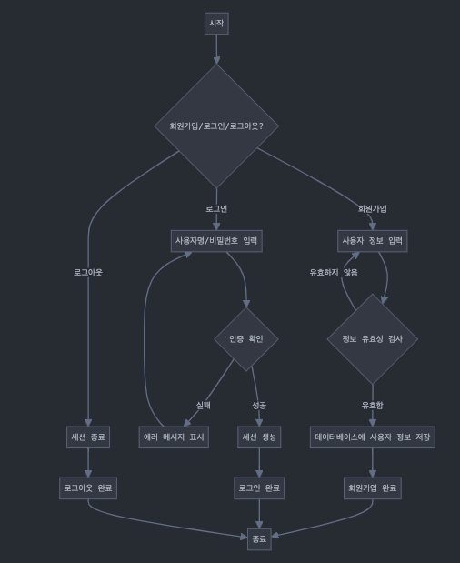

<h1>테이블 설명</h1>
<h3>
  각각 User 테이블, accounts 테이블, Transaction_history 테이블을 지칭한다.</h3>
  
  
  User 테이블은, primary key인 <strong>Id</strong>가 있고 필드엔  
  로그인시 사용할 이메일 
  비밀번호 
  닉네임 
  이름 
  전화번호 
  마지막 로그인 
  스태프 여부 
  관리자 여부 
  계정 활성화 여부 
  로 이루어져있다.
  

  accounts 테이블은, primary key인 <strong>Id</strong>가 있고, 
  정한 유저에 해당되는 정보를 가져와야하기 때문에 foreign key로 <strong>User_Id</strong>를 가져와야한다. 필드엔  
  유저 정보 
  계좌번호 
  은행코드 
  계좌종류 
  잔액 
  로 이루어져있다.
  

  transactions 테이블은, primary key인 <strong>Id</strong>가 있고, 
  정한 계좌에 해당되는 정보를 가져와야하기 때문에 foreign key로 <strong>Accounts_Id</strong>를 가져와야한다. 필드엔  
  계좌정보 
  거래금액 
  거래 후 잔액 
  계좌인자내역 
  입출금 타입 
  거래 타입 
  거래 일시 
  로 이루어져있다.

  

회원가입, 로그인, 로그아웃의 기능은 다음과 같다.
<h2>회원가입</h2>
회원가입은 먼저 사용자에게 해당 정보를 받아온다. 이때 정보가 올바르게 들어가지않으면 에러를 내며, 
정상적으로 입력되었다면 해당 정보를 데이터베이스에 저장한다.

<h2>로그인</h2>
로그인은 회원가입 때 데이터베이스에 들어온 정보를 토대로, 옳게 입력했을 시 세션을 생성하고 로그인이 완료된다. 
그러나 입력된 정보와 다를 시, 오류 메시지를 올리며 다시 로그인창으로 리턴시킨다.

<h2>로그아웃</h2>
로그아웃을 하면 세션을 종료시키고 로그아웃하여 다시 회원가입 또는 로그인을 할 수 있게끔 만든다.
